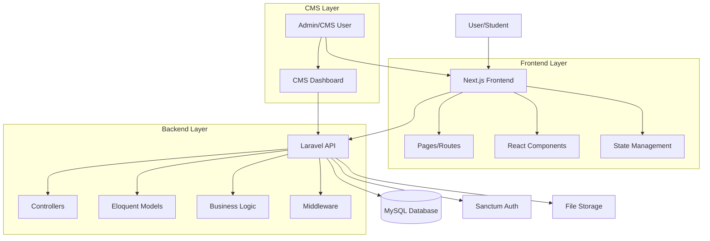

# PRASASTA Learning Center - Architecture

## System Overview

PRASASTA Learning Center adalah platform training center untuk pelatihan mekanik alat berat dan operator dengan arsitektur modern menggunakan Laravel sebagai backend dan Next.js sebagai frontend.

## Architecture Diagram

## Technology Stack

### Backend (Laravel)
- **Framework**: Laravel 11
- **Database**: MySQL 8.0+
- **Authentication**: Laravel Sanctum
- **API**: RESTful API
- **File Storage**: Local/S3

### Frontend (Next.js)
- **Framework**: Next.js 14 (App Router)
- **Language**: TypeScript
- **Styling**: Tailwind CSS
- **UI Components**: Shadcn/ui
- **State Management**: React Context / Zustand
- **API Client**: Axios / Fetch

## Database Schema

### Core Tables
- `users` - Admin & CMS users
- `students` - Student profiles
- `instructors` - Instructor profiles
- `courses` - Course information
- `course_categories` - Course categories
- `enrollments` - Student enrollments
- `lessons` - Course lessons
- `materials` - Learning materials
- `certificates` - Certificates issued

## API Structure

### Public Endpoints (`/api/v1`)
- `GET /courses` - List courses (with filters: category_id, level, search, featured)
- `GET /courses/{slug}` - Course detail by slug
- `GET /categories` - List categories
- `GET /categories/{slug}` - Category detail with courses
- `GET /instructors` - List instructors
- `GET /instructors/{id}` - Instructor detail
- `POST /enrollments` - Create enrollment (public registration)

### Protected Endpoints (Student) - TODO
- `GET /api/v1/student/enrollments` - Student enrollments
- `GET /api/v1/student/courses/{id}/lessons` - Course lessons
- `POST /api/v1/student/courses/{id}/complete` - Mark lesson complete

### Admin Endpoints (`/api/v1/admin`) - Requires Sanctum Auth
- **Courses:**
  - `GET /admin/courses` - List all courses (with search, status filter)
  - `POST /admin/courses` - Create course
  - `GET /admin/courses/{id}` - Get course detail
  - `PUT /admin/courses/{id}` - Update course
  - `DELETE /admin/courses/{id}` - Delete course

- **Instructors:**
  - `GET /admin/instructors` - List all instructors
  - `POST /admin/instructors` - Create instructor
  - `GET /admin/instructors/{id}` - Get instructor detail
  - `PUT /admin/instructors/{id}` - Update instructor
  - `DELETE /admin/instructors/{id}` - Delete instructor

- **Enrollments:**
  - `GET /admin/enrollments` - List enrollments (with filters)
  - `PUT /admin/enrollments/{id}` - Update enrollment status

## Data Flow

### Course Enrollment Flow
1. Student browses courses on frontend
2. Student clicks "Enroll" → Frontend calls `POST /api/enrollments`
3. Backend validates and creates enrollment
4. Backend sends confirmation email
5. Student can access course materials

### CMS Content Management Flow
1. Admin logs into CMS dashboard
2. Admin creates/edits course via CMS interface
3. CMS calls Laravel API endpoints
4. Backend validates and saves to database
5. Changes reflected on public frontend

## Security

- API authentication via Sanctum tokens
- Role-based access control (Admin, Instructor, Student)
- CSRF protection
- Input validation & sanitization
- File upload validation
- Rate limiting on API endpoints

## Deployment Considerations

- Backend: Laravel on PHP 8.2+ server
- Frontend: Next.js static export or Vercel deployment
- Database: MySQL on dedicated server
- File Storage: S3 or local storage
- CDN: For static assets and media files

